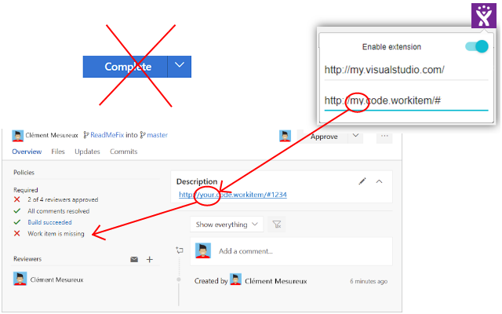

# VSTS handle external workitem
With this extension you can use an external work item system.

Install the extension, type your.visualstudio.com url and your work item system base url.

If pattern matches with description field you can complete your pull request otherwise the button is removed.

VSTS External WorkItem injects a js file into vsts then it removes official workitem module.